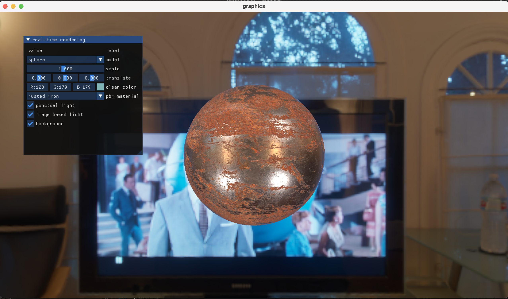
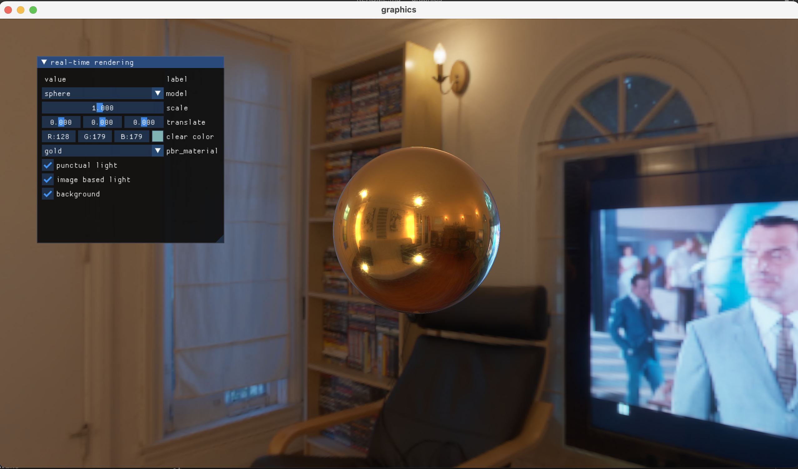

# 介绍

基于OpenGL实现了基于物理的渲染

# 特点

- 采用了 image-based lighting
- 使用 imgui 提供用户控制接口
- 具有多种材质

# 依赖

- OpenGL
- glfw
- glew
- glm
- stb_image
- imgui

# 环境配置

MacOS，需要提前安装 homebrew，stb_image 及 imgui 已内置。

```zsh
brew install glfw glew glm
mkdir build
cd build
cmake ..
make
cd ..
```

# 运行
运行目录为./bin

```
cd ./bin
./graphics
```

使用option键可以隐藏或显示鼠标，在鼠标隐藏时可以wasd移动相机位置，鼠标控制相机朝向，在鼠标显示时可以进行UI设置。

# 运行结果



# License
This code is licensed under the MIT License (see [LICENSE](LICENSE)).